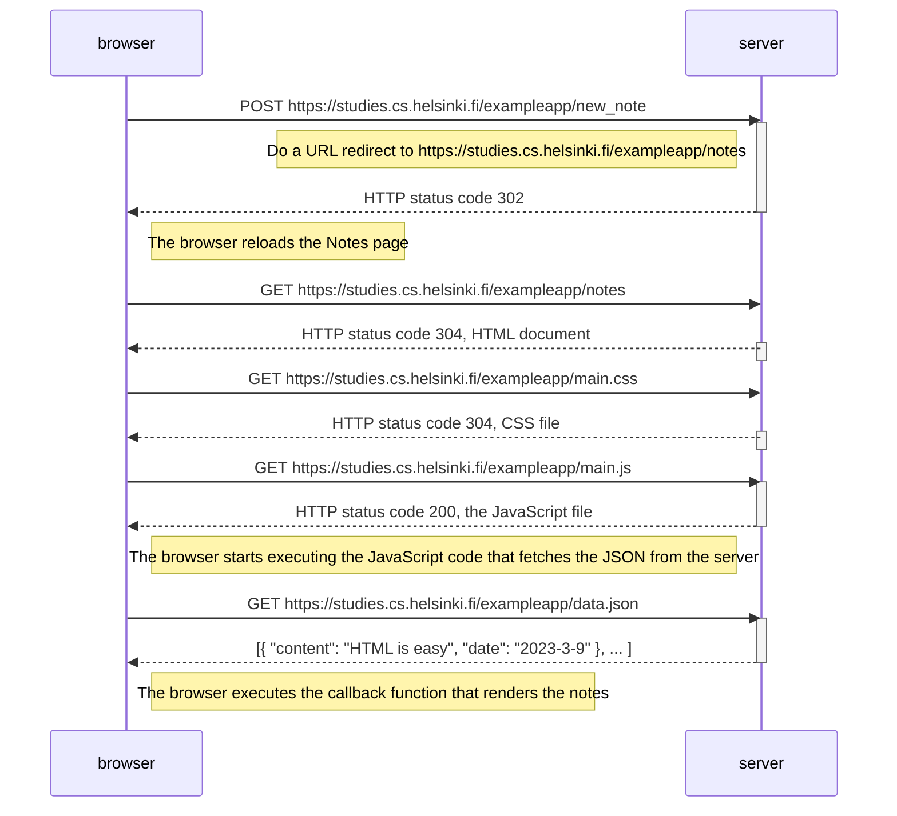

```mermaid

sequenceDiagram
    participant browser

    browser->>server: POST https://studies.cs.helsinki.fi/exampleapp/new_note
    activate server
    Note left of server: Do a URL redirect to https://studies.cs.helsinki.fi/exampleapp/notes
    server-->>browser: HTTP status code 302
    deactivate server

    Note right of browser: The browser reloads the Notes page
    
    browser->>server: GET https://studies.cs.helsinki.fi/exampleapp/notes
    server-->>browser: HTTP status code 304, HTML document
    activate server
    deactivate server
    
    browser->>server: GET https://studies.cs.helsinki.fi/exampleapp/main.css
    server-->>browser: HTTP status code 304, CSS file
    activate server
    deactivate server
    
    browser->>server: GET https://studies.cs.helsinki.fi/exampleapp/main.js
    activate server
    server-->>browser: HTTP status code 200, the JavaScript file
    deactivate server
    
    Note right of browser: The browser starts executing the JavaScript code that fetches the JSON from the server
    
    browser->>server: GET https://studies.cs.helsinki.fi/exampleapp/data.json
    activate server
    server-->>browser: [{ "content": "HTML is easy", "date": "2023-3-9" }, ... ]
    deactivate server

    Note right of browser: The browser executes the callback function that renders the notes

```